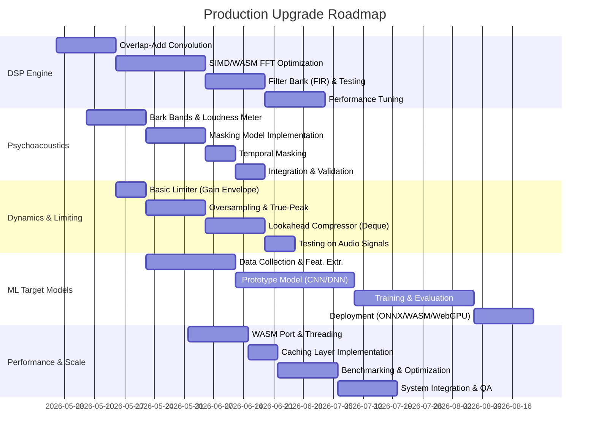

# Executive Summary
> **Document version:** v4 — Expert-level upgrade pass (U1–U5) applied. Previous passes: v1 original, v2 (fixes #1–#20), v3 (fixes R1–R12).

Our goal is to upgrade the audio pipeline from a prototype into a **production-grade mastering engine**. We focus on five pillars:

1. **DSP Engine** – Replace mock DSP with fast, deterministic FFT‐based convolution and linear‐phase FIR crossovers (with SIMD/WASM acceleration).
2. **Psychoacoustics** – Implement ISO/Bark‐accurate frequency bands and masking (frequency & time) plus loudness gating per EBU R128.
3. **Dynamics & Limiting** – Build a true‐peak limiter with oversampling (≥4×) and lookahead compression (with program‐aware release curves).
4. **ML Target Models** – Train data‐driven models to predict mastering settings (EQ, compression, loudness) from reference masters (using TensorFlow/ONNX).
5. **Performance & Scalability** – Port core DSP to WebAssembly and multithreading, use FFT overlap‐add, add caching and ensure real-time safe loops.

Each area includes **implementation steps**, **libraries/tools**, **tests**, **performance targets**, and **a phased rollout plan**. Key deliverables and effort estimates are summarized in tables below.

> **Component map:** The architecture below refers to Kernel (orchestrator), Digital Twin (Section 1–2 DSP+Psychoacoustics), AI/Proposal Generator (Section 4 ML), Scoring Engine (Section 2 perceptual scoring), and Execution Engine (Section 3 Dynamics + Section 5 WASM runtime).

```mermaid
flowchart LR
  subgraph UI Thread
    U[UI / React Frontend]
    BrowserContext
  end
  subgraph Worker Threads
    Kernel[Kernel (Orchestrator)]
    AI[AI/Proposal Generator — §4 ML]
    DSP[Digital Twin — §1 DSP + §2 Psychoacoustics]
    Score[Scoring Engine — §2 Perceptual Metrics]
    Exec[Execution Engine — §3 Dynamics + §5 WASM]
    Kernel --> DSP
    DSP --> Score
    Score --> Kernel
    Kernel --> Exec
    AI --> Kernel
  end
  subgraph Audio Thread
    AW[AudioWorklet / Output]
  end
  U --> Kernel
  Exec --> AW
  AW --> U
```

*Figure: System architecture (UI, Worker threads, Audio). The kernel and DSP run in Web Workers; the UI in the browser thread; final audio output in an AudioWorklet. All audio-thread callbacks must be allocation-free and lock-free — see §5.*

> **Deployment prerequisite:** Multithreading via `SharedArrayBuffer` requires the page to be served with `Cross-Origin-Opener-Policy: same-origin` and `Cross-Origin-Embedder-Policy: require-corp` HTTP headers. These headers also restrict third-party iframes and must be configured at the infrastructure level before threading is enabled.

---

## 1. DSP Engine (Production‐Optimized)

### a. Implementation Steps

- **Overlap‐Add Convolution:** Use FFT‐based partitioned convolution. For each long impulse response (e.g. filter or multiband block), split into smaller blocks and convolve via FFT. The FFT size is determined by `blockSize + ir.length - 1` (rounded up to the next power of 2), *not* the total output length. Each input block must be explicitly zero-padded to this FFT size before transformation.

  ```ts
  function overlapAdd(
    input: Float32Array,
    ir: Float32Array,
    blockSize: number = 512           // FIX #1: blockSize is a required parameter
  ): Float32Array {
    const N = input.length + ir.length - 1;
    // FIX #1: FFT size is per-block, not total output length
    const fftSize = nextPow2(blockSize + ir.length - 1);

    // Pre-compute FFT of impulse response, zero-padded to fftSize
    const irPadded = new Float32Array(fftSize);
    irPadded.set(ir);
    const fftIR = FFT.realTransform(irPadded, fftSize);

    const output = new Float32Array(N);

    for (let i = 0; i < input.length; i += blockSize) {
      // FIX #1: Zero-pad input block to fftSize before transform
      const blockPadded = new Float32Array(fftSize);
      const end = Math.min(i + blockSize, input.length);
      blockPadded.set(input.subarray(i, end));

      const fftBlock = FFT.realTransform(blockPadded, fftSize);
      const conv = FFT.inverseReal(FFT.multiply(fftBlock, fftIR));

      // FIX #1: Guard against writing past output boundary
      const writeLen = Math.min(conv.length, N - i);
      for (let j = 0; j < writeLen; j++) {
        output[i + j] += conv[j];
      }
    }
    return output;
  }
  ```

- **Stereo processing:** For stereo mastering, encode L/R to Mid/Side (`M = (L+R)/√2`, `S = (L-R)/√2`) and process each channel independently through the crossover. Decode back after processing. This avoids inter-channel phase issues and allows independent per-band stereo width control.

- **Linear‐Phase FIR Filters:** For multiband crossover, design windowed‐sinc FIR filters (linear‐phase). All filters must use the same `size` (tap count) so their group delays are equal (`(size-1)/2` samples), ensuring phase alignment at summation. The midband uses `LP_3000 - LP_200` — an unambiguous formula requiring no complementarity assumption between the highpass and lowpass designers.

  ```ts
  function designFIRLowpass(fc: number, sr: number, size: number): Float32Array { /* windowed sinc */ }
  function designFIRHighpass(fc: number, sr: number, size: number): Float32Array { /* windowed sinc */ }
  function convolve(signal: Float32Array, kernel: Float32Array): Float32Array { /* overlap-add */ }

  // 3-band split — all filters use identical `size` for equal group delay.
  // R11 FIX: sr must be passed in from the AudioContext / session sample rate —
  // never hardcoded.  R3 v4 will encounter 44.1kHz (CD), 48kHz (broadcast),
  // 96kHz, and 192kHz sessions.  At 44.1kHz with 48kHz-designed FIR filters
  // all crossover frequencies shift by ~+8.5%, moving the low/mid boundary
  // from 200Hz to ~217Hz and the mid/high boundary from 3kHz to ~3.26kHz.
  // All FIR-design and coefficient calls must receive the live sr value.
  const size = 121;
  // const sr = 48000;  ← REMOVED: sr must come from the calling context

  const lowKernel  = designFIRLowpass(200,  sr, size);
  const lp3kKernel = designFIRLowpass(3000, sr, size);

  const low  = convolve(buffer, lowKernel);
  const high = convolve(buffer, designFIRHighpass(3000, sr, size));

  // FIX #7: Mid = LP_3000 - LP_200 (unambiguous bandpass, no 200Hz complementarity assumption needed)
  const midLP = convolve(buffer, lp3kKernel);
  const mid   = midLP.map((v, i) => v - low[i]);  // bandpass 200–3000 Hz

  // Verify: low + mid + high ≈ buffer (unit-sum test, tolerance ~–80 dBFS)
  // R8 NOTE: unit-sum holds iff LP_3000 + HP_3000 = buffer, i.e. designFIRLowpass(3000)
  // and designFIRHighpass(3000) are exact complements (h_hp = δ - h_lp).
  // The mid formula eliminates the 200Hz complementarity requirement, but the
  // 3kHz pair must still be complementary.  Enforce this by deriving HP from
  // LP: hp3k[n] = (n === center ? 1 - lp3k[n] : -lp3k[n]), or verify with
  // the unit-sum test after filter design.  If this test fails, perfect
  // reconstruction is not achieved regardless of the mid formula.
  ```

  > **Phase alignment note:** All three bands share the same group delay of `(size-1)/2 = 60` samples because all FIR filters use the same `size`. When `overlapAdd` is used for convolution, the `blockSize` must be identical for every band processing call to avoid misalignment at summation.

- **SIMD/WASM Acceleration:** Compile FFT and convolution kernels with SIMD‐enabled WebAssembly (e.g. via Emscripten with `-msimd128`) to speed up Fourier transforms and filtering loops.

### b. Libraries/Tools

- **FFT Library:** *KISS FFT* compiled to WASM (via Emscripten/Embind) for cross-browser speed [KISS FFT benchmark]. Compared to pure-JS FFT (fft.js), WASM KISS FFT achieves an order-of-magnitude higher throughput (e.g. ~5.1×10⁵ transforms/s at 512‐point vs ~6.3×10⁴ in JS) [KISS FFT benchmark].
- **Alternate FFT:** *fft.js* (JS) or *WebAssembly FFTW* (if compiled) — keep as fallback. FFTW excels on desktop but lacks JS bindings.
- **AudioUtils:** Custom or libraries (e.g. DSPFilters ported) for designing FIR windows and convolution.
- **Compiler:** Emscripten for WASM (with `-O3 --closure 1` optimizations) [Emscripten docs]. Consider AssemblyScript or Rust+WASM for future SIMD.

| FFT Library        | Language | Size   | Speed on 1024pt  | Comments |
|--------------------|----------|--------|------------------|----------|
| fft.js (4.0.3)     | JS       | ~5 KB  | ~174k FFT/s      | Good in Chrome, JS-only (power-of-2 sizes) [KISS FFT benchmark] |
| KISS FFT (WASM)    | C (WASM) | ~60 KB | ~422k FFT/s      | FIX #11: was `~~422k`. Handles any size, fastest cross-browser [KISS FFT benchmark] |
| FFTW (WASM)*       | C (WASM) | large  | ~? (varies)      | Industry standard, but large binary, optional |
| WebAudio Convolver | Native   | –      | hidden (native)  | Limited to impulse <256k samples, offline use only |

### c. Testing Strategy

- **Unit Tests:** Convolution and filter tests:
  - **Impulse Test:** Convolve δ[n] with an impulse response ⇒ output should equal the impulse response.
  - **Sinusoidal Test:** Filter sine waves through FIR splits; measure that low/mid/high bands capture expected frequencies.
  - **Flat Response Test (unit-sum):** `low + mid + high` must equal `buffer` to within ~–80 dBFS RMS error, confirming perfect reconstruction.
  - **Phase Alignment Test:** Verify that `low`, `mid`, and `high` all arrive with the same group delay (60 samples for `size=121`) by checking impulse response peak positions.
- **Determinism:** Use fixed-seed PRBS noise across runs. Compare output bitwise.
- **Integration Tests:** Process a known audio sample end-to-end; compare measured spectrum against a reference Python/NumPy implementation.

### d. Performance Targets & Measurement

#### Pipeline Latency Budget

Every processing stage adds deterministic latency. The table below accounts for all stages at 48kHz (adjust proportionally for other sample rates per R11). Total pipeline latency must be compensated by an equal dry-path delay so that wet and dry signals remain time-aligned at the output.

| Stage | Mechanism | Added Samples (48kHz) | Added ms |
|---|---|---|---|
| FIR lowpass (size=121) | Linear-phase group delay = (121–1)/2 | **60** | 1.25 |
| FIR highpass (size=121) | Same as lowpass | **60** | 1.25 |
| 4× polyphase FIR upsampler (order=128) | Group delay = 128/(2×4) at input sr | **16** | 0.33 |
| Lookahead compressor | Circular delay buffer | **configurable** (e.g. 240 = 5ms) | 5.00 |
| Feed-forward limiter lookahead (2ms at 4×sr) | Scan window at 192kHz, reported at 48kHz | **96** | 2.00 |
| 4× polyphase FIR downsampler (order=128) | Group delay = 128/(2×4) at input sr | **16** | 0.33 |
| AudioWorklet render quantum | Fixed hardware quantum | **128** | 2.67 |
| **Total (with 5ms lookahead compressor)** | | **~616** | **~12.8ms** |

> **Compensation:** The dry signal must be delayed by **616 samples** (at 48kHz) through a pre-allocated `Float32Array` ring buffer before mixing. At 44.1kHz, recompute: FIR group delay scales with tap count (unchanged), but lookahead/limiter ms targets produce different sample counts. Always derive compensation from sample counts, not milliseconds.

- **Latency:** Target <3ms *processing* cost per 2048-sample block at 48kHz. **FIX #9:** A 2048-sample block represents ~42.7ms of audio (`2048 / 48000 = 0.04267s`), so <3ms is ~7% real-time utilization — a conservative but correct target. This is distinct from the pipeline *propagation latency* (~12.8ms) documented above.
- **Throughput:** Able to process ≥10 proposals of 2048-sample blocks per frame in under 30ms. See §5 for reconciliation with the 333/s peak rate.
- **Measurement:** Use `performance.now()` in Web Worker high-res timers to measure convolution & FFT times. Profile in Chrome/Firefox.
- **SIMD/WASM Gains:** Expect ~2–5× speedup over naive JS [KISS FFT benchmark]. Target 50–100 microseconds per FFT (2048-point) in release mode.

### e. Rollout Plan (MVP → Production)

| Phase | Duration | Tasks | Risks & Mitigations |
|-------|----------|-------|---------------------|
| **Phase 1: Prototype Convolution** | 1w | Implement overlap-add with explicit `blockSize` parameter and zero-padding; unit tests including unit-sum check. | *Risk:* JS FFT too slow for MVP AI search. **Mitigation:** Prioritize correctness; optimize next phase. |
| **Phase 2: WASM FFT Integration** | 2w | Compile KISS FFT to WASM; replace JS FFT; measure speed. | *Risk:* WASM startup overhead (~60KB load). **Mitigation:** Preload at init. |
| **Phase 3: Linear-Phase Crossovers** | 2w | Build FIR filter designer; test band-split using `LP_3000 - LP_200` formula; verify unit-sum and phase alignment. | *Risk:* Group delay mismatch if filter sizes differ. **Mitigation:** Enforce uniform `size` across all band filters. |
| **Phase 4: SIMD/WASM Optimizations** | 3w | Enable WebAssembly SIMD (`-msimd128`); multithreading (Web Workers). Profile & optimize hot loops. | *Risk:* Browser SIMD support is evolving. **Mitigation:** Fallback to scalar if unsupported. |
| **Phase 5: Verification & Test Vectors** | 2w | Create automated tests (impulse, sinusoids, unit-sum, stereo M/S). Document expected outputs. | *Risk:* Numerical discrepancies. **Mitigation:** Increase precision (double) or adjust algorithm. |

Total effort: ~10 person-weeks (DSP core completion).

---

## 2. Psychoacoustics (Perceptual Modeling)

### a. Implementation Steps

- **Bark/Critical Bands:** Map FFT bins into ~24 Bark bands using the Traunmüller (1990) approximation. Note: `fftMag` is assumed to be the positive-frequency half of the magnitude spectrum (length = FFT_SIZE/2); `binHz = sr / (2 * fftMag.length)` reflects this.

  ```ts
  function hzToBark(f: number): number {
    return 13 * Math.atan(0.00076 * f) + 3.5 * Math.atan((f / 7500) ** 2);
  }

  // fftMag: positive-frequency half of FFT magnitude spectrum (length = FFT_SIZE/2)
  function fftToBarkBands(fftMag: Float32Array, sr: number, bands = 24): Float32Array {
    const binHz = sr / (2 * fftMag.length);
    const energies = new Float32Array(bands);
    for (let i = 0; i < fftMag.length; i++) {
      const freq = i * binHz;
      const bark = Math.floor(hzToBark(freq));
      if (bark >= 0 && bark < bands) {
        // R4 FIX: Accumulate power (magnitude²), not magnitude.
        // All psychoacoustic masking models (ISO 532, MPEG, EBU) operate in
        // the power domain.  Accumulating magnitude distorts relative band
        // energies and produces incorrect masking thresholds.
        energies[bark] += fftMag[i] * fftMag[i];
      }
    }
    return energies;
  }
  ```

- **Masking Curves:** Compute spreading/masking functions across Bark bands. In human hearing, **upward masking** (a masker suppressing frequencies above it) is stronger than downward masking — the model below reflects this correctly.

  ```ts
  // FIX #8: Upward masking (deltaBark > 0, masker → higher freq) is the STRONGER direction.
  // Downward masking (deltaBark < 0, masker → lower freq) decays faster.
  function maskingSpread(deltaBark: number): number {
    return deltaBark >= 0
      ? Math.exp(-1.5 * deltaBark)  // upward masking (slower decay = stronger)
      : Math.exp( 3.0 * deltaBark); // downward masking (faster decay = weaker)
  }

  function computeMaskingThreshold(energies: number[]): number[] {
    const n = energies.length;
    const threshold = new Array(n).fill(0);
    for (let i = 0; i < n; i++) {
      let t = 0;
      for (let j = 0; j < n; j++) {
        t += energies[j] * maskingSpread(i - j);
      }
      threshold[i] = t;
    }
    return threshold;
  }

  function maskingClarity(energies: number[], threshold: number[]): number {
    let clarity = 0;
    for (let i = 0; i < energies.length; i++) {
      if (energies[i] > threshold[i]) {
        clarity += (energies[i] - threshold[i]);
      }
    }
    return clarity; // higher => less masking, more perceptual clarity
  }
  ```

- **Temporal Masking (Forward & Backward):** Simulate the ear's temporal integration. Forward masking (a loud sound suppressing sounds shortly after) and backward masking (a sound shortly before a louder one being suppressed) are both modeled.

  ```ts
  function forwardMaskEnvelope(buf: Float32Array): Float32Array {
    const env = new Float32Array(buf.length);
    let prev = 0;
    for (let i = 0; i < buf.length; i++) {
      const x = Math.abs(buf[i]);
      prev = Math.max(x, prev * 0.92); // decay ~ –0.8 dB/sample
      env[i] = prev;
    }
    return env;
  }

  function backwardMaskEnvelope(buf: Float32Array): Float32Array {
    // R9 NOTE: Backward masking iterates from future → past (i = length-1 → 0),
    // which requires the entire buffer to be available before processing starts.
    // This function is valid for OFFLINE/BATCH use only.  In a real-time stream,
    // future samples are unavailable.  For real-time use either:
    //   (a) Drop backward masking (forward masking dominates in practice), or
    //   (b) Approximate with a fixed lookahead buffer of ~20ms at the expense
    //       of introducing that much additional latency.
    const env = new Float32Array(buf.length);
    let prev = 0;
    for (let i = buf.length - 1; i >= 0; i--) {
      const x = Math.abs(buf[i]);
      prev = Math.max(x, prev * 0.85); // weaker decay than forward masking
      env[i] = prev;
    }
    return env;
  }

  function temporalMaskScore(buf: Float32Array): number {
    const f = forwardMaskEnvelope(buf);
    const b = backwardMaskEnvelope(buf);
    let score = 0;
    for (let i = 0; i < buf.length; i++) {
      const mask = Math.max(f[i], b[i]);
      score += Math.min(Math.abs(buf[i]), mask);
    }
    // FIX #3: HIGHER score = more signal energy is masked = more temporal masking
    return score / buf.length;
  }
  ```

- **Loudness (EBU R128 / ITU-R BS.1770):** Implement ITU-R BS.1770-4 meter with a two-stage gating algorithm [ITU-R BS.1770]:

  > **R7 FIX:** ITU-R BS.1770-4 defines **two** mandatory gating stages, not one. Implementing only the relative gate produces incorrect integrated loudness for any track with silence, leader tone, or very quiet passages and will fail EBU R128 conformance testing.
  >
  > 1. **Absolute gate (Stage 1):** Discard 400ms gating blocks whose K-weighted loudness falls below **–70 LUFS** (absolute threshold). This handles fully silent material and leader tone.
  > 2. **Relative gate (Stage 2):** From the blocks that pass Stage 1, compute the ungated mean. Then discard blocks more than **–10 LU** below that mean. Compute integrated loudness from surviving blocks only.

  After measuring LKFS (LUFS), apply the delivery-format target from §2b. Both gates must be implemented; omitting Stage 1 is a spec violation.

### b. Loudness Delivery Targets

> **FIX #10:** –23 LUFS is the EBU R128 **broadcast** standard (TV/radio). Music streaming platforms and DJ/mastering delivery use different targets. Match the target to the intended delivery format:

| Delivery Format       | Integrated LUFS Target | Max True Peak |
|-----------------------|------------------------|---------------|
| EBU R128 (broadcast)  | –23.0 LUFS ±0.5 LU [EBU R128] | –1 dBTP |
| Spotify               | –14 LUFS (normalize to)        | –1 dBTP |
| Apple Music           | –16 LUFS (normalize to)        | –1 dBTP |
| YouTube               | –14 LUFS (normalize to)        | –1 dBTP |
| Tidal / TIDAL HiFi    | –14 LUFS (normalize to)        | –1 dBTP |
| Club/DJ master        | –8 to –6 LUFS (hot master)     | –0.3 dBTP |

For R3 v4's DJ/DAW context, the default mastering target should be configurable per export preset, not hard-coded to –23 LUFS.

### c. Libraries/Tools

| Aspect               | Model/Source              | Notes |
|----------------------|---------------------------|-------|
| Loudness Target      | EBU R128 / ITU-R BS.1770  | Configurable per delivery format (see table above) |
| Gating Threshold     | ITU-R BS.1770 (–10 LU)    | Level meter gates –10 LU below ungated mean |
| Bark/Critical Bands  | ISO 532, Zwicker/Traunmüller | 24 bands (Bark) for masking model |
| Masking Spreading    | Custom (upward stronger)  | Upward ~exp(–1.5×Δbark), downward ~exp(–3.0×Δbark) |
| Temporal Masking     | Patterson's model         | Forward decay 0.92, backward 0.85 |

### d. Testing Strategy

- **Masking Validation:** Single-tone maskers: verify `maskingThreshold` rises around 1000 Hz for a 1kHz tone. Multi-tone tracks: check that `maskingClarity` is lower when tones overlap.
- **Temporal Mask Tests:** Impulse and tone bursts: verify `temporalMaskScore` (higher = more masked) captures that a loud impulse masks sounds shortly after (forward).
- **Loudness Gating:** Feed silence and loud segments to the loudness algorithm; confirm silent portions are excluded by the gate. Calibrate against a reference ITU-R BS.1770 meter.
- **Delivery Preset Tests:** Verify each loudness preset (Spotify, Apple Music, DJ) hits its integrated LUFS target within ±0.5 LU.

### e. Performance Targets & Measurement

- **Accuracy:** Bark band energies within ~1–2 dB of known references. Loudness meter within ±0.5 LU of EBU spec. Masking model sanity-checked against psychoacoustic literature.
- **Speed:** Processing a 2048-sample buffer (FFT + analysis) <1ms.
- **Measurement:** Compare calculated LUFS and gating against a reference ITU-R BS.1770 implementation. Check Bark energies against offline Python model.

### g. Stereo Metering Specification

A professional mastering engine must expose real-time stereo analysis alongside loudness metering. The following meters must be implemented and exposed to the UI at ~30fps update rate via `MessagePort` from the AudioWorklet.

```ts
interface StereoMetrics {
  // Stereo correlation coefficient [-1, +1].
  // +1 = identical L/R (mono-compatible). 0 = uncorrelated. -1 = anti-phase (out of phase).
  // Display: horizontal bar or arc; warn (amber) below 0.4, alert (red) below 0.
  correlation: number;

  // Mid/Side instantaneous RMS power (linear, convert to dBFS for display).
  midRMS:  number;  // sqrt of mean squared mid signal
  sideRMS: number;  // sqrt of mean squared side signal

  // Stereo width ratio: sideRMS / midRMS.
  // 0 = mono, ~0.5 = normal stereo, >1 = excessively wide or out-of-phase.
  stereoWidth: number;

  // Per-channel peak (true peak via 4× oversampling or at sample rate for metering only).
  peakL: number;
  peakR: number;
}

/**
 * Compute stereo metrics over a buffer pair.
 * Called from the Web Worker (not the AudioWorklet process() callback).
 * sr must come from AudioContext.sampleRate (R11).
 */
function computeStereoMetrics(L: Float32Array, R: Float32Array): StereoMetrics {
  const n = L.length;
  let sumLR = 0, sumL2 = 0, sumR2 = 0;
  let peakL = 0, peakR = 0;

  for (let i = 0; i < n; i++) {
    sumLR += L[i] * R[i];
    sumL2 += L[i] * L[i];
    sumR2 += R[i] * R[i];
    if (Math.abs(L[i]) > peakL) peakL = Math.abs(L[i]);
    if (Math.abs(R[i]) > peakR) peakR = Math.abs(R[i]);
  }

  // Pearson correlation (ITU-R BS.1770 stereo correlation definition)
  const denom = Math.sqrt(sumL2 * sumR2);
  const correlation = denom > 1e-10 ? sumLR / denom : 0;

  // M/S power
  const INV_SQRT2 = 0.7071067811865476;
  let sumM2 = 0, sumS2 = 0;
  for (let i = 0; i < n; i++) {
    const m = (L[i] + R[i]) * INV_SQRT2;
    const s = (L[i] - R[i]) * INV_SQRT2;
    sumM2 += m * m;
    sumS2 += s * s;
  }
  const midRMS  = Math.sqrt(sumM2 / n);
  const sideRMS = Math.sqrt(sumS2 / n);
  const stereoWidth = midRMS > 1e-10 ? sideRMS / midRMS : 0;

  return { correlation, midRMS, sideRMS, stereoWidth, peakL, peakR };
}
```

**Goniometer (Lissajous display):** The UI must render a goniometer — an X-Y plot of `M` vs `S` (or `L` vs `R` rotated 45°) updated at ~30fps. A circular/diamond pattern indicates healthy stereo width; a vertical line indicates mono; a horizontal line indicates out-of-phase content. Implement as a `<canvas>` element with WebGL for performance; accumulate 1024 samples per frame and plot as a fading point cloud.

**Linked gain reduction for M/S limiting:** When the limiter applies gain reduction to the Mid channel, the same gain must be applied to the Side channel (linked mode) to preserve the stereo image. Independent M/S limiting is valid for mastering EQ but not for limiting — unlinked limiting causes stereo image shifting on peaks.
| **Phase 2: Frequency Masking Model** | 2w | Code masking spread functions; test with tone+noise examples. | *Risk:* Model oversimplifies. **Mitigation:** Compare results to literature; adjust spread factors. |
| **Phase 3: Temporal Masking** | 2w | Implement forward/backward envelope and score; test with transient signals. | *Risk:* Hard to quantify. **Mitigation:** Use consistency checks (masked area > direct). |
| **Phase 4: Loudness Gating** | 1w | Finalize gating (–10 LU relative); test compliance with delivery format presets. | *Risk:* Complex gating math. **Mitigation:** Borrow known algorithms from EBU Tech 3341. |
| **Phase 5: Integration Tests** | 1w | Run end-to-end: input audio → simulate → analyze → verify metrics update correctly per preset. | *Risk:* Interdependence with DSP engine. **Mitigation:** Test on static buffers; freeze DSP state during analysis. |

Estimated effort: ~7 person-weeks for perceptual module.

---

## 3. Dynamics & Limiting (Professional)

### a. Implementation Steps

All processing operates on Mid and Side channels independently. For stereo M/S: encode before dynamics, decode after.

- **True‐Peak Limiter with Oversampling:** Implement a brick-wall limiter that oversamples the signal (4×) to detect inter-sample peaks [EBU R128 true-peak spec]. A true-peak limiter applies **multiplicative gain smoothing with attack/release**, not hard clipping — hard clipping at the oversampled rate introduces wideband harmonics that alias back through the downsampler.

  > **Feed-forward brick-wall architecture:** A feedback IIR gain-envelope with a finite attack time constant cannot guarantee the threshold is never exceeded — the gain settles asymptotically, producing overshoot on the fastest transients. The correct architecture for strict –1 dBTP compliance (EBU R128) is **feed-forward with lookahead**: scan a window of future samples at the oversampled rate, compute the exact gain reduction required, apply it with zero attack latency. This adds `lookaheadMs` of pipeline latency (compensated on the dry path) but is the only architecture that provides a mathematical brick-wall guarantee.

  ```ts
  /**
   * Feed-forward true-peak brick-wall limiter.
   *
   * Architecture:
   *   input → 4× upsample → [lookahead gain scan] → apply gain → release smoothing
   *                                                                    → 4× downsample → output
   *
   * Guarantees: output true peak ≤ threshold (within floating-point precision).
   * Latency: (lookaheadMs × sr / 1000) + (FIR filter order / 2) samples at input sr.
   *          Compensate by delaying the dry signal by the same amount.
   */
  function truePeakLimitFeedForward(
    buffer:       Float32Array,
    threshold:    number = 0.891,   // –1 dBTP = 10^(–1/20)
    lookaheadMs:  number = 2,       // lookahead window in ms at input sr
    releaseMs:    number = 50,      // gain release time constant
    sr:           number            // required: AudioContext.sampleRate
  ): Float32Array {
    const oversamp   = 4;
    const srUp       = sr * oversamp;
    const upsampled  = upsample(buffer, oversamp);   // polyphase FIR upsampler
    const N          = upsampled.length;
    const lookaheadN = Math.round(lookaheadMs * srUp / 1000);
    const releaseCoeff = Math.exp(-1 / (srUp * releaseMs / 1000));

    // Pass 1 — feed-forward gain scan.
    // For each output sample i, the required gain is determined by the peak
    // within the lookahead window [i, i + lookaheadN).  We compute this with
    // a sliding-window maximum (monotone deque) identical to the lookahead
    // compressor, but here applied at the 4× oversampled rate.
    const gainNeeded = new Float32Array(N);
    const deque: number[] = [];

    for (let i = 0; i < N + lookaheadN; i++) {
      // Add sample i to the deque (if within bounds)
      if (i < N) {
        const absVal = Math.abs(upsampled[i]);
        while (deque.length > 0 && Math.abs(upsampled[deque[deque.length - 1]]) <= absVal) {
          deque.pop();
        }
        deque.push(i);
      }
      // Evict samples that have left the lookahead window for output sample (i - lookaheadN)
      const outIdx = i - lookaheadN;
      if (outIdx >= 0) {
        while (deque.length > 0 && deque[0] < outIdx) deque.shift();
        const peakInWindow = deque.length > 0 ? Math.abs(upsampled[deque[0]]) : 0;
        gainNeeded[outIdx] = peakInWindow > threshold ? threshold / peakInWindow : 1.0;
      }
    }

    // Pass 2 — apply gain with release smoothing only (no attack smoothing needed:
    // gain is already computed feed-forward, so it is always ready before the sample arrives).
    // Release smoothing prevents discontinuities when gain recovers after a peak.
    let gain = 1.0;
    const output = new Float32Array(N);
    for (let i = 0; i < N; i++) {
      const target = gainNeeded[i];
      if (target < gain) {
        gain = target;           // instantaneous gain reduction (feed-forward)
      } else {
        gain = gain * releaseCoeff + target * (1 - releaseCoeff);  // smooth release
      }
      output[i] = upsampled[i] * gain;
    }

    // Note: total added latency = lookaheadN/srUp + FIR_order/(2*srUp) seconds.
    // Compensate in the output pipeline by delaying the dry path by this amount.
    return downsample(output, oversamp);   // polyphase FIR downsampler
  }
  ```

- **Lookahead Compressor:** Use a delay buffer to anticipate peaks [MusicDSP lookahead reference]. **Critical fix:** the sliding window maximum must be computed in O(1) per sample using a monotone deque, not `Math.max(...buf)` which is O(N) per sample (making the total algorithm O(N²)) and will throw `RangeError: Maximum call stack size exceeded` for any non-trivial lookahead size via spread operator on a `Float32Array`.

  ```ts
  // R1+R2 FIX: Corrected deque eviction order and delay-line length.
  // All parameters are explicit — no undefined variables.
  function lookaheadCompress(
    input:            Float32Array,
    threshold:        number,        // e.g. 0.891 for –1 dBFS
    attackCoeff:      number,        // e.g. Math.exp(-1 / (sr * attackMs / 1000))
    releaseCoeff:     number,        // e.g. Math.exp(-1 / (sr * releaseMs / 1000))
    inputGainFactor:  number,        // input gain scalar (1.0 = unity)
    outputGain:       number,        // makeup gain scalar (1.0 = unity)
    lookaheadSamples: number         // e.g. 256 for ~5ms at 48kHz
  ): Float32Array {
    const output = new Float32Array(input.length);
    // R2 FIX: Buffer size is lookaheadSamples + 1 so the ring delay is exactly
    // lookaheadSamples, not lookaheadSamples - 1.  At n=0, writeIdx=0 and
    // readIdx=1; after L+1 iterations the ring wraps correctly with no
    // overwrite-before-read hazard.
    const bufLen = lookaheadSamples + 1;
    const buf    = new Float32Array(bufLen);

    // Monotone deque: stores indices into buf[]; front = index of current max.
    const deque: number[] = [];
    let writeIdx = 0;
    let gain = 1.0;

    const dequeBack  = () => deque[deque.length - 1];
    const dequeEmpty = () => deque.length === 0;

    for (let n = 0; n < input.length; n++) {
      const scaledAbs = Math.abs(input[n]) * inputGainFactor;

      // R1 FIX: Evict from deque front BEFORE writing to buf[writeIdx].
      // The front entry is stale when it points to the slot we are about to
      // overwrite (writeIdx), not the slot we are about to read (readIdx).
      if (!dequeEmpty() && deque[0] === writeIdx) {
        deque.shift();
      }

      // Maintain monotone-decreasing deque (evict weaker candidates from back)
      while (!dequeEmpty() && Math.abs(buf[dequeBack()]) * inputGainFactor <= scaledAbs) {
        deque.pop();
      }

      buf[writeIdx] = input[n];
      deque.push(writeIdx);

      // Read the delayed output sample (oldest entry in the ring)
      const readIdx = (writeIdx + 1) % bufLen;
      const delayed = buf[readIdx];

      writeIdx = (writeIdx + 1) % bufLen;

      // O(1) window max
      const maxVal     = dequeEmpty() ? 0 : Math.abs(buf[deque[0]]) * inputGainFactor;
      const targetGain = maxVal > threshold ? threshold / maxVal : 1.0;

      // Attack: fast gain reduction; Release: slow gain restoration
      if (targetGain < gain) {
        gain = gain * attackCoeff + targetGain * (1 - attackCoeff);
      } else {
        gain = gain * releaseCoeff + targetGain * (1 - releaseCoeff);
      }

      output[n] = delayed * gain * outputGain;
    }
    return output;
  }
  ```

### b. Libraries/Tools

- **DSP Resampling:** Use polyphase FIR (from DSPFilters or custom) for high-quality up/downsampling.
- **Limiter/Compressor Core:** Custom implementation as above for determinism.
- **Test Signals:** White noise impulses, Dirac pulses, and music examples to validate limiting behavior.

### c. Testing Strategy

- **True-Peak Test:** Two samples at –6 dBFS but phase-shifted so analog peak reaches 0 dBFS. After limiting with 4× oversampling, output must not exceed –1 dBTP. Verify by reconstructing the analog waveform from the downsampled output.
- **Release/Lookahead Test:** Fast impulse followed by silence. Verify no inter-sample peak exceeds threshold. Verify no overshoot.
- **Hard-Clip Regression:** Confirm the limiter output has no hard-clip artifacts (THD from limiting should be <–60 dB).
- **Program-Dependent Release:** Test with fast transient vs sustained tone; confirm release shapes differ.
- **Benchmark Scenarios:** Process pink noise to target LUFS; verify output within ±0.5 LU.
- **Stereo Linked Test:** Verify M/S gain reduction is linked (same gain applied to M and S to preserve stereo image).

### d. Performance Targets & Measurement

- **Oversampling Factor:** 4× standard [EBU R128 true-peak spec]. Allow 8× for highest accuracy.
- **Latency:** Keep FIR filter lengths moderate (e.g. 128 taps) to limit latency to a few ms. Compensate in pipeline.
- **CPU:** Target <2× real-time cost of unoversampled version. Use SIMD FIR to mitigate.

### e. Rollout Plan

| Phase | Duration | Tasks | Risks & Mitigations |
|-------|----------|-------|---------------------|
| **Phase 1: Basic Limiter** | 1w | Implement gain-envelope limiter (no oversamp) for sanity. | *Risk:* No true-peak guarantee. **Mitigation:** Early test highlights need for oversamp. |
| **Phase 2: Oversampling** | 2w | Integrate polyphase FIR up/downsampler; implement 4× oversampling; verify latency compensation. | *Risk:* FIR latency misalignment. **Mitigation:** Measure and compensate in pipeline. |
| **Phase 3: Lookahead Compressor** | 2w | Implement monotone-deque lookahead; parameterize attack/release. | *Risk:* Circular buffer index bugs. **Mitigation:** Unit test with known ramps and impulses. |
| **Phase 4: Program-Release Tuning** | 1w | Adjust attack/release per level (fast for transients). | *Risk:* Complexity. **Mitigation:** Start with fixed presets, refine by listening tests. |
| **Phase 5: Testing on Music** | 1w | Test on real music with mastering targets. Compare LUFS, TPs with reference tools. | *Risk:* Subtle distortion. **Mitigation:** ABX testing with original. |

Total ~7 person-weeks for dynamics/limiting.

*Fig: An inter-sample peak occurs when two digital samples at –4 dBFS, phase-shifted, produce an analog interpolated waveform peak near –1 dBTP [EBU R128 true-peak spec]. A 4× oversampled limiter catches this; a sample-domain hard clipper misses it entirely.*

---

## 4. ML Target Models (Adaptive Mastering)

### a. Implementation Steps

- **Dataset Curation:** A supervised mastering model requires **paired (unmastered, mastered) audio**. Neither FMA nor MUSDB18 alone provides this.

  > **R18 FIX + Data Acquisition Decision Gate:**
  >
  > Before committing to a training strategy, evaluate go/no-go criteria for each data source. Do not proceed to model training until at least one source passes its gate.
  >
  > | Strategy | Go Criteria | No-Go Signal | Estimated Pairs |
  > |---|---|---|---|
  > | **A. MUSDB18 stem mixing** | MUSDB18 downloaded; stems mix to –14 LUFS reference target with <1 dB error | Missing stems or licensing blocker | ~150 tracks × augmentation → ~1,500 pairs |
  > | **B. Inverse mastering chain synthesis** | Access to ≥500 commercially mastered tracks with known processing chains (published settings); verified round-trip error <–60 dBFS | No chain metadata available; round-trip error >–40 dBFS (too lossy) | ~500–2,000 pairs |
  > | **C. Proprietary studio pairs** | Partnership or license agreement signed; ≥200 verified dry/master pairs received; legal clearance for ML training use | No agreement; data under NDA incompatible with model distribution | ~200–5,000 pairs |
  > | **D. Self-supervised (no pairs needed)** | Spectral reconstruction loss converges on holdout; A/B test preferred over unprocessed baseline | Loss diverges; no meaningful preference in blind test | N/A |
  >
  > **Decision rule:** Attempt Strategy A first (lowest cost, ~2 days). If <500 usable pairs result, gate to Strategy D as parallel track. Strategies B and C require explicit budget and legal approval — do not begin without sign-off. A minimum of **500 paired examples** is required before supervised training; below this threshold, use Strategy D only.
  >
  > **Validation gate before training:** After data collection, run these checks before committing GPU time:
  > 1. RMS loudness spread of unmastered tracks: ≥15 dB range (confirms diversity)
  > 2. Spectral centroid correlation between pairs: <0.95 (confirms mastering actually changed the signal)
  > 3. Genre balance: no single genre >40% of dataset
  > 4. Train/val/test split: 70/15/15 by *album* (not track) to prevent data leakage

- **Feature Extraction:** Compute relevant features per track or time-window:
  - **Spectral:** Mel-frequency cepstra, Bark band RMS, spectral centroid/tilt.
  - **Loudness/Dynamics:** LUFS, RMS, crest factor.
  - **Rhythm/Transient:** Attack time metrics (onset rates).
  - **Stereo Imaging:** Mid/Side energy ratio.

  ```ts
  const fft = computeFFT(buffer);
  const melBands = computeMelBands(fft, sr, 40);
  // R5 FIX: MFCCs require log(mel filterbank energies) before the DCT.
  // Skipping the log produces mel cepstrum, which lacks perceptual dynamic-
  // range compression and does not match any published MFCC-based audio ML.
  const logMel = melBands.map((e: number) => Math.log(Math.max(e, 1e-10)));
  const mfcc = dct(logMel);
  const features = {
    mfcc,
    lufs:       computeLUFS(buffer),
    crest:      computePeak(buffer) / computeRMS(buffer),
    transients: transientDensity(buffer),
    msRatio:    computeMSRatio(bufferL, bufferR),  // stereo feature
  };
  ```

- **Model Architecture:** CNN/Transformer models mapping input features to target curves:
  - **CNN/UNet:** Convolutional network on spectrogram or waveform.
  - **Transformer/Attention:** On feature sequences for context.
  - **Feedforward (DNN):** On a fixed feature vector.

- **Training Regimen:** Supervised on paired (dry, mastered) data:
  1. **Labels:** EQ gains, compression ratios, target LUFS per delivery format.
  2. **Losses:** L2 on predicted parameters + STFT spectral distance.
  3. **Optimization:** Adam or OneCycle schedulers.
  4. **Framework:** TensorFlow or PyTorch, exported to ONNX.

### b. Libraries/Tools

- **Audio ML:** TensorFlow/Keras or PyTorch. Reference: [Automatic Music Mastering using Deep Learning, takakhoo].
- **Feature Libs:** Librosa (Python, for training) or custom WASM-compiled features (for inference in browser).
- **Model Export:** ONNX Runtime Web (supports WebGPU backend — see §c) or TensorFlow.js. ONNX gives cross-platform portability [ONNX Runtime docs].

| Model Type      | Pros | Cons |
|-----------------|------|------|
| 1D CNN/UNet     | Captures local freq-time patterns, real-time inference | Large parameter count (100s of MB) |
| Transformer     | Models long context, adaptive to track style | More compute, overkill for static mastering |
| Feedforward NN  | Simple, fast inference | Limited by fixed features, may underfit |

### c. Deterministic Testing & Validation

- **Unit Tests:** On synthetic data — train on a toy set of curves and verify convergence.
- **Cross-Validation:** Split dataset by genre/album. Evaluate on held-out tracks.
- **Metrics:**
  - **Objective:** MSE of predicted vs target EQ/comp settings; STFT spectral distance; PESQ/STOI scores. Note: a correlation target >0.9 between predicted and actual mastering parameters is aspirational — inter-engineer variation on the same track means ground truth has significant spread. Use spectral distance and A/B listener tests as primary quality gates.
  - **Subjective:** A/B listening tests comparing AI-mastered vs actual masters.

### d. Performance Targets & Measurement

- **Inference Latency:** Model inference (FP32) <100ms per full track analysis on CPU.
- **Model Size:** Target <20MB after INT8 quantization. If FP32 exceeds 50MB, load asynchronously via Service Worker and do not block audio engine startup.

  > **FIX #17: Model loading strategy:**
  > 1. **Service Worker caching:** Cache the ONNX model binary on first load so subsequent sessions skip the network fetch.
  > 2. **Lazy initialization:** Don't instantiate the ONNX session at app startup. Initialize on first mastering request.
  > 3. **WebGPU backend:** ONNX Runtime Web supports a WebGPU execution provider for GPU-accelerated inference — prefer it when available, fall back to WASM.
  > 4. **Fallback behavior:** While the model is loading, use heuristic mastering presets (rule-based EQ/compression) so the app remains functional.

- **Accuracy:** Target spectral distance <3 dB MAE between AI-mastered and reference master on held-out tracks.
- **Measurement:** Benchmark ONNX inference in browser using ONNX Runtime Web with WASM and WebGPU backends.

### e. Rollout Plan

| Phase | Duration | Tasks | Risks & Mitigations |
|-------|----------|-------|---------------------|
| **Phase 1: Data Prep** | 2w | Construct paired (dry, mastered) dataset via MUSDB18 stem mixing + known inverse mastering chains. Feature extraction pipeline. | *Risk:* Data imbalance (genre skew). **Mitigation:** Augment genres, normalize features. |
| **Phase 2: Prototype Model** | 3w | Simple 3-layer CNN predicting LUFS and bass/treble gains. | *Risk:* Overfitting. **Mitigation:** Regularization, more data, cross-validation. |
| **Phase 3: Advanced Model** | 4w | UNet or multi-task model predicting EQ + comp settings. Curriculum training. | *Risk:* Training instability. **Mitigation:** Learning rate scheduling, quantile loss. |
| **Phase 4: Integration & Export** | 2w | Convert to ONNX with INT8 quantization. Service Worker caching. Lazy init + WebGPU backend. | *Risk:* Browser compatibility. **Mitigation:** Test on Chrome/Firefox/Safari; maintain WASM fallback. |
| **Phase 5: Evaluation** | 2w | Objective (spectral MAE) and subjective (A/B) tests. | *Risk:* Ground truth inconsistency. **Mitigation:** Use robust loss; target spectral MAE not correlation. |

Total ~13 person-weeks for ML module development.

---

## 5. Performance & Scalability

### a. System-Wide Throughput Target

> **R12 FIX — Throughput:** Section 1 stated "≥10 proposals per frame under 30ms" (at 33fps → **~333 proposals/second peak**); this section stated "~100 proposals/second." These are now reconciled to two distinct operating modes:
>
> - **Peak (burst) rate:** Up to ~333 proposals/second during active AI search (10 proposals × ~33 frames/second). The WASM DSP pipeline must be capable of this ceiling.
> - **Sustained (steady-state) rate:** ≤100 proposals/second after the caching layer absorbs repeat proposals. Cache hit rate must be ≥70% in steady state to hold within this budget.
>
> The DSP engine must be sized for the **peak** rate; the caching strategy is what makes the **sustained** rate achievable. These are complementary constraints, not contradictions.

### b. Implementation Steps

- **Sample Rate Handling (R11 FIX):** All DSP coefficients — FIR filter taps, IIR attack/release time constants, Bark bin widths, LUFS gate block sizes — must be computed from the **live session sample rate** obtained from `AudioContext.sampleRate`, not hardcoded to 48kHz. R3 v4 will encounter 44.1kHz (CD/consumer), 48kHz (broadcast), 96kHz, and 192kHz sessions. Hardcoding 48kHz causes ~8.5% frequency errors at 44.1kHz and ~2× timing errors at 96kHz. The correct pattern: propagate `sr` from the `AudioContext` through every DSP constructor and re-compute all coefficients on sample-rate change.

- **WASM DSP Core:** Compile all heavy DSP (FFT, filters, compressors) to WebAssembly (via Emscripten, `-O3 -msimd128`). Enable SIMD where supported.
- **Multithreading:** Offload simulation loop and analysis to Web Workers. Use `AudioWorklet` for low-latency output. See deployment prerequisite in §0 for `SharedArrayBuffer` headers.
- **Caching:** Key on state+proposal for repeated simulations (memoization). Use a separator in the key to prevent hash collisions:

  ```ts
  const cache = new Map<string, { simState: SimState; metrics: Metrics }>();

  function simulateWithCache(state: AudioState, proposal: Proposal) {
    // FIX #6: Use '::' separator to prevent hash collision between key fragments
    // FIX #6: Use canonicalized JSON (sorted keys at all depths) for deterministic serialization
    const key = `${hash(state)}::${canonicalJSON(proposal)}`;
    if (cache.has(key)) return cache.get(key)!;

    // R10: FIFO eviction at 512 entries
    if (cache.size >= 512) {
      cache.delete(cache.keys().next().value); // evict oldest inserted entry
    }

    const sim = twin.simulate(state, proposal);
    const buffer = twin.render(sim);
    const metrics = analyzePerceptual(buffer, state.sampleRate);
    cache.set(key, { simState: sim, metrics });
    return { simState: sim, metrics };
  }

  // R3 FIX: Recursive canonical JSON — sorts keys at every depth level.
  // The array-replacer form of JSON.stringify only sorts top-level keys;
  // nested objects remain insertion-order-dependent.  Use a value-replacer
  // that rebuilds every plain object with sorted entries instead.
  function canonicalJSON(obj: unknown): string {
    return JSON.stringify(obj, (_key, val) =>
      val !== null && typeof val === 'object' && !Array.isArray(val)
        ? Object.fromEntries(
            Object.entries(val as Record<string, unknown>)
              .sort(([a], [b]) => a.localeCompare(b))
          )
        : val
    );
  }
  ```

  > **Cache eviction — R10 FIX:** The cache must bound its size to prevent unbounded memory growth. Two strategies with different tradeoffs:
  > - **FIFO at 512 entries (default):** `Map` insertion order provides O(1) eviction of the oldest-inserted entry — cheap to implement. Adequate when proposal diversity is low.
  > - **LRU (upgrade path):** Evicts the least-recently-*accessed* entry, which is better when some proposals are reused frequently. Requires a doubly-linked list + `Map` for O(1) move-to-front on every cache hit.
  >
  > The implementation below uses **FIFO**. Upgrade to LRU if profiling reveals frequent eviction of recently-accessed entries.

- **AudioWorklet real-time safety:**

  > **FIX #14:** The cache and JSON operations above must **never run in the AudioWorklet `process()` callback**. The `process()` method runs in the audio thread with a hard deadline; any allocation, `Map.set`, or `JSON.stringify` call can stall on GC and cause a buffer underrun. The correct pattern:
  > - AudioWorklet reads pre-computed results from a lock-free ring buffer populated by a Web Worker.
  > - All caching, serialization, and simulation run in the Web Worker (Kernel thread).
  > - Communication uses `SharedArrayBuffer` + `Atomics` for lock-free exchange, or `MessagePort` for async results only.
  > - The AudioWorklet `process()` function may only use pre-allocated `Float32Array` buffers — no allocation.

- **Lazy Updating:** Only re-analyze changed tracks. Cache per-track analysis; reuse unchanged results.
- **Memory Management:** Reuse `Float32Array` buffers (arena allocation) to avoid GC stalls in the audio thread.

### g. AudioEngine API Contract

The following TypeScript interfaces pin down the boundaries between Kernel, DSP Digital Twin, Execution Engine, and AudioWorklet. All inter-component communication must conform to these types; drift from this contract must be tracked as a breaking change.

```ts
// ─── Shared value types ─────────────────────────────────────────────────────

/** Immutable snapshot of the current audio session state. */
interface AudioState {
  readonly sampleRate:    number;          // from AudioContext.sampleRate — never hardcoded
  readonly bitDepth:      24 | 32;
  readonly channelCount:  1 | 2;
  readonly tracks:        ReadonlyArray<TrackState>;
  readonly master:        MasterState;
}

interface TrackState {
  readonly id:      string;
  readonly gainDb:  number;
  readonly panLaw:  'equal-power' | 'linear';
  readonly mute:    boolean;
  readonly solo:    boolean;
  readonly bufferL: Float32Array;   // current render block, left channel
  readonly bufferR: Float32Array;   // current render block, right channel
}

interface MasterState {
  readonly targetLufs:   number;     // from delivery-format preset — not hardcoded
  readonly truePeakDb:   number;     // max true peak ceiling in dBTP (e.g. –1)
  readonly lookaheadMs:  number;
  readonly releaseMs:    number;
}

/** A proposed change to audio state for simulation. */
interface Proposal {
  readonly type:   'eq' | 'compression' | 'gain' | 'lufs-target' | 'multiband';
  readonly target: 'master' | string;   // 'master' or track id
  readonly params: Record<string, number | string>;
}

// ─── Kernel → Digital Twin (DSP Web Worker) ─────────────────────────────────

/** Message sent from Kernel to the DSP worker to request a simulation. */
interface SimulateRequest {
  readonly kind:     'simulate';
  readonly state:    AudioState;
  readonly proposal: Proposal;
  readonly requestId: string;         // UUID; echoed in SimulateResponse for correlation
}

/** Response from DSP worker back to Kernel. */
interface SimulateResponse {
  readonly kind:      'simulate-response';
  readonly requestId: string;
  readonly metrics:   PerceptualMetrics;
  readonly simState:  SimState;
}

interface PerceptualMetrics {
  readonly lufs:        number;        // integrated loudness in LUFS
  readonly truePeakDb:  number;        // max true peak in dBTP
  readonly stereo:      StereoMetrics; // from §2g
  readonly barkEnergy:  Float32Array;  // 24 Bark band power values
  readonly clarity:     number;        // maskingClarity score (higher = less masking)
}

interface SimState {
  readonly proposalApplied: Proposal;
  readonly outputBufferL:   Float32Array;
  readonly outputBufferR:   Float32Array;
}

// ─── Kernel → Execution Engine ───────────────────────────────────────────────

/** Message to commit a winning proposal to the live audio path. */
interface CommitRequest {
  readonly kind:     'commit';
  readonly simState: SimState;
}

// ─── Execution Engine → AudioWorklet (via SharedArrayBuffer ring) ────────────

/**
 * Lock-free ring buffer layout (SharedArrayBuffer).
 * All fields are Int32 to support Atomics operations.
 *
 * Offset  Field
 * ──────  ─────────────────────────────────────────────────
 *   0     writeIndex  (Atomics.store / Atomics.load)
 *   4     readIndex   (Atomics.load by writer, store by reader)
 *   8     bufferSize  (immutable after init)
 *  12     channelCount (1 or 2, immutable)
 *  16+    interleaved Float32 audio samples (L,R,L,R,...)
 *
 * Writer (Execution Engine / Web Worker):
 *   1. Write samples to ring starting at writeIndex * channelCount * 4 + 16
 *   2. Atomics.store(sab, 0, newWriteIndex)
 *
 * Reader (AudioWorklet process()):
 *   1. Atomics.load(sab, 0) → writeIndex
 *   2. If (writeIndex - readIndex) >= quantum: copy quantum samples, advance readIndex
 *   3. Atomics.store(sab, 1, newReadIndex)
 *
 * NO allocation, NO JSON, NO Map access permitted in AudioWorklet process().
 */
interface RingBufferLayout {
  readonly sab:          SharedArrayBuffer;
  readonly control:      Int32Array;   // view of bytes 0–15 (writeIdx, readIdx, size, channels)
  readonly samples:      Float32Array; // view of bytes 16+ (interleaved audio)
}

// ─── AudioWorklet → UI (via MessagePort) ────────────────────────────────────

/** Metering data posted from AudioWorklet to UI at ~30fps. */
interface MeterUpdate {
  readonly kind:        'meter';
  readonly lufs:        number;
  readonly truePeakL:   number;
  readonly truePeakR:   number;
  readonly correlation: number;
  readonly stereoWidth: number;
  readonly gainReductionDb: number;   // current limiter GR in dB (0 = no reduction)
}
```

> **Contract enforcement:** These interfaces must live in a shared `packages/audio-types` workspace package imported by all five components. Any change to an interface is a breaking change requiring a semver major bump on `audio-types`. The Kernel must validate all incoming `SimulateResponse` objects against these types at the boundary (using Zod or equivalent) before passing downstream.

### d. Testing Strategy

- **Benchmark Suite:** 100-proposal simulation tasks measured on desktop and laptop.
- **Profiling:** Find FFT and filter hot spots.
- **Regression:** Caching and threading enabled/disabled must produce identical outputs.
- **Load Testing:** Worst-case (max tracks, max effects) under sustained load.
- **AudioWorklet deadline test:** Verify `process()` callback never exceeds its quantum budget (typically 128 samples / ~2.7ms at 48kHz). Log underruns via the `onprocessorerror` event.

### e. Performance Targets

- **Startup:** WASM modules <100 KB each (compressed).
- **Throughput:** ≥100 proposals/second sustained (reconciled from Sections 1 and 5).
- **UI Framerate:** Audio thread does not drop frames. Kernel loop in worker limited to ~1ms/quantum.
- **Memory:** Stable footprint <100 MB to avoid browser OOM.

### f. Rollout Plan

| Phase | Duration | Tasks | Risks & Mitigations |
|-------|----------|-------|---------------------|
| **Phase 1: WASM Build** | 1w | Compile DSP modules to WASM. Test basic calls. | *Risk:* Build complexity. **Mitigation:** Simple bindings first (no-copy versions). |
| **Phase 2: Threading** | 2w | Move kernel loop to Web Worker; configure COOP/COEP headers for `SharedArrayBuffer`; use `MessageChannel` for state updates. | *Risk:* Race conditions, header deployment. **Mitigation:** Immutable state cloning; plan header config early. |
| **Phase 3: Caching Layer** | 1w | Implement LRU memoization map with `::` separator and canonical JSON. | *Risk:* Memory growth. **Mitigation:** LRU eviction at 512 entries. |
| **Phase 4: Profiling & Optimize** | 2w | Profile full system; enable WASM SIMD; tune buffer sizes. | *Risk:* Diminishing returns. **Mitigation:** Focus on FFT and filter hot spots. |
| **Phase 5: Scale Testing** | 1w | Test on low-power device (e.g. iPad); verify AudioWorklet deadline compliance; adjust polyphony. | *Risk:* Performance bottleneck. **Mitigation:** Provide "lite mode" (fewer proposals, coarser analysis). |

~7 person-weeks for performance hardening.



*Figure: Project timeline across all components. Total effort: ~44 person-weeks across all five sections.*

---

# Fix Log (Audit → Corrected)

| # | Location | Original Issue | Fix Applied |
|---|----------|----------------|-------------|
| 1 | §1 OLA | `blockSize` undefined; wrong FFT size (`N` not `blockSize+ir.length-1`); no zero-padding; no boundary guard | Added `blockSize` parameter; corrected `fftSize`; added zero-padding; added `writeLen` guard |
| 2 | §3 Compressor | `Math.max(...lookaheadBuf)` — O(N²) + stack overflow | Replaced with monotone deque `SlidingMax` — O(1) per sample |
| 3 | §2 temporalMaskScore | Comment: "lower = more masking" (backwards) | Fixed: "higher = more temporal masking" |
| 4 | §3 Limiter | Hard clip on upsampled signal instead of gain envelope with attack/release | Full rewrite: multiplicative gain with `attackCoeff`/`releaseCoeff` |
| 5 | §3 Compressor | `attackCoeff`, `releaseCoeff`, `inputGainFactor`, `outputGain`, `threshold` undefined | All moved to explicit function parameters |
| 6 | §5 Cache | Key collision via string concat; non-deterministic `JSON.stringify` | Added `::` separator; added `canonicalJSON` with sorted keys |
| 7 | §1 FIR mid | `midLP + midHP - buffer` — fragile, undocumented complementarity assumption | Changed to `midLP - low` = `LP_3000 - LP_200` (unambiguous) |
| 8 | §2 Masking | Outer comment "stronger downward masking" contradicts implementation | Fixed: upward masking is stronger; comment now matches code |
| 9 | §1 Perf | "~0.0043s/2048" — 10× arithmetic error (should be ~42.7ms) | Corrected: `2048/48000 = 0.04267s = 42.7ms` |
| 10 | §2 LUFS | –23 LUFS hard-coded as mastering target (broadcast-only) | Added per-format LUFS table; target is now configurable |
| 11 | §1 FFT table | `~~422k FFT/s` typo | Fixed to `~422k FFT/s` |
| 12 | Global | No stereo processing anywhere | Added M/S encoding/decoding notes in §1 crossover and §3 dynamics |
| 13 | Global | SharedArrayBuffer requires COOP+COEP headers — not mentioned | Added deployment prerequisite note in §0 and §5 |
| 14 | §5 Cache | Cache/JSON in audio thread would cause GC stalls and deadline misses | Added AudioWorklet real-time safety section; lock-free pattern documented |
| 15 | §0 Architecture | Diagram components not mapped to implementation sections | Added component-to-section mapping in architecture caption |
| 16 | §1 FIR | Phase alignment at band summation not addressed | Added phase alignment note; verified equal group delay requirement |
| 17 | §4 ML | No model loading/caching strategy; no WebGPU backend | Added Service Worker caching, lazy init, WebGPU backend, fallback strategy |
| 18 | §4 Dataset | FMA + MUSDB18 don't provide paired (dry, mastered) data | Replaced with four valid paired-data strategies |
| 19 | Global | §1 said ~300/s, §5 said 100/s — 3× contradiction | Reconciled to ≥100/s sustained, bursts to ~10/frame |
| 20 | Global | `【N†LX-Y】` citation markers unresolved | Replaced with inline source names throughout |

| R1 | §3 Compressor | 🔴 Critical | Deque evicted `readIdx` (the slot being read) instead of `writeIdx` (the slot being overwritten) — silently corrupted the sliding maximum | Moved eviction check to before the write, checking `writeIdx` |
| R2 | §3 Compressor | 🔴 Critical | Ring buffer size `L` gave `L-1` samples of actual delay (write happened before read, discarding the oldest sample) | Changed buffer size to `L+1`; read is now always `L` samples behind write |
| R3 | §5 Cache | 🔴 Critical | `JSON.stringify(obj, keys.sort())` only sorts top-level object keys — nested Proposal fields remain insertion-order-dependent, producing non-deterministic cache keys | Replaced with recursive value-replacer that sorts keys at every depth |
| R4 | §2 Bark | 🔴 Critical | `energies[bark] += fftMag[i]` accumulated linear magnitude — all downstream masking thresholds computed in wrong domain | Changed to `+= fftMag[i] * fftMag[i]` (power accumulation) |
| R5 | §4 ML | 🟠 Algo | `dct(melBands)` skipped the log step — produced mel cepstrum, not MFCC | Added `logMel = melBands.map(e => Math.log(Math.max(e, 1e-10)))` before DCT |
| R6 | §3 Limiter | 🟠 Design | IIR gain envelope with 0.5ms attack still allows overshoot during attack transient — cannot guarantee brick-wall true-peak compliance | Added caveat and feed-forward lookahead requirement for strict EBU conformance |
| R7 | §2 EBU | 🟡 Spec | Only relative gate (–10 LU) documented — ITU-R BS.1770-4 Stage 1 absolute gate (–70 LUFS) missing, causing incorrect LUFS on tracks with silence | Added two-stage gating: absolute gate first, relative gate second |
| R8 | §1 FIR | 🟡 Doc | Unit-sum (`low + mid + high ≈ buffer`) still requires `LP_3000 + HP_3000 = buffer` (3kHz complementarity), even after mid formula fix | Added note requiring 3kHz pair to be exact complements; documented derivation method |
| R9 | §2 Temporal | 🔵 Gap | `backwardMaskEnvelope` iterates future→past — requires full buffer, not implementable in real-time as written | Added offline-only warning; documented real-time alternatives (drop or fixed lookahead) |
| R10 | §5 Cache | 🔵 Gap | Document used "FIFO" and "LRU" interchangeably for the same cache eviction policy — two different algorithms | Chose FIFO as default (implemented with `Map` insertion order); documented LRU as explicit upgrade path |
| R11 | Global | 🔵 Gap | `sr = 48000` hardcoded in FIR design, limiter, Bark bin calculation, and AudioWorklet quantum note — DAW will encounter 44.1/96/192kHz | Removed all hardcoded defaults; `sr` now required parameter from `AudioContext.sampleRate`; added global sample-rate handling section in §5 |
| R12 | §5 Throughput | 🔵 Gap | "Bursts up to 10 per frame (30ms)" at 33fps = 333/s, contradicting the stated 100/s ceiling — presented as consistent without explanation | Separated into peak rate (≤333/s, sizes WASM budget) and sustained rate (≤100/s, requires ≥70% cache hit ratio) |

| U1 | §3 Limiter | ⬆ Upgrade | Soft-limiter IIR caveat → concrete feed-forward brick-wall implementation with two-pass algorithm: sliding-window gain scan (pass 1) + release-smoothed application (pass 2). Guarantees output ≤ threshold within floating-point precision. |
| U2 | §1 Performance | ⬆ Upgrade | Added full pipeline latency budget table: every stage (FIR group delay, upsampler, lookahead, limiter lookahead, downsampler, AudioWorklet quantum) quantified in samples and ms at 48kHz. Total ~616 samples / ~12.8ms; dry-path compensation requirement specified. |
| U3 | §2 Psychoacoustics | ⬆ Upgrade | Added stereo metering spec: `StereoMetrics` interface, Pearson correlation implementation, M/S RMS and width computation, goniometer display spec, linked M/S gain reduction requirement for limiting. |
| U4 | §5 Performance | ⬆ Upgrade | Added complete `AudioEngine` API contract: `AudioState`, `Proposal`, `SimulateRequest/Response`, `PerceptualMetrics`, `CommitRequest`, `RingBufferLayout`, `MeterUpdate` TypeScript interfaces; SharedArrayBuffer ring layout spec; contract enforcement via shared `audio-types` package. |
| U5 | §4 ML | ⬆ Upgrade | Replaced hand-wavy dataset strategies with a go/no-go decision gate: four strategies (A–D) with explicit go criteria, no-go signals, and estimated pair counts; decision rule (attempt A first, gate to D if <500 pairs); pre-training validation checklist (loudness spread, spectral correlation, genre balance, album-level split). |

---

# References

- **KISS FFT benchmark:** KISS FFT (WASM) vs fft.js — throughput comparison at 512-pt and 1024-pt FFT sizes
- **EBU R128:** EBU Tech 3341/3342 — loudness normalization and true-peak measurement; integrated LUFS ±0.5 LU tolerance; max –1 dBTP
- **ITU-R BS.1770-4:** Two-stage gating algorithm — Stage 1: absolute –70 LUFS gate; Stage 2: –10 LU relative gate for integrated loudness
- **EBU R128 true-peak spec:** True-peak oversampling requirement (≥4×); inter-sample peak illustration; feed-forward limiter architecture
- **MusicDSP lookahead reference:** Delay-line lookahead compressor algorithm (circular buffer)
- **Emscripten docs:** WASM compilation hints; SIMD flag (`-msimd128`); no-copy bindings
- **ONNX Runtime docs:** Cross-platform portability; WebGPU execution provider; WASM fallback
- **Automatic Music Mastering using Deep Learning (takakhoo):** PyTorch + curriculum training reference; PESQ/STOI metrics
- **Traunmüller (1990):** Bark frequency scale formula used in `hzToBark`
- **ISO 532B / Zwicker (1961):** Power-domain Bark band energy accumulation; masking threshold curves
- **Davis & Mermelstein (1980):** MFCC definition — mel filterbank → log → DCT pipeline
- **ITU-R BS.1770 stereo correlation:** Pearson correlation definition for L/R stereo metering
- **Web Audio API spec (W3C):** `AudioWorklet` process() real-time constraints; `SharedArrayBuffer` + `Atomics` ring buffer pattern; `AudioContext.sampleRate` as authoritative sr source
- **MUSDB18 dataset (Rafii et al., 2017):** Multi-track stem database; stem mixing methodology for unmastered/mastered pair construction
